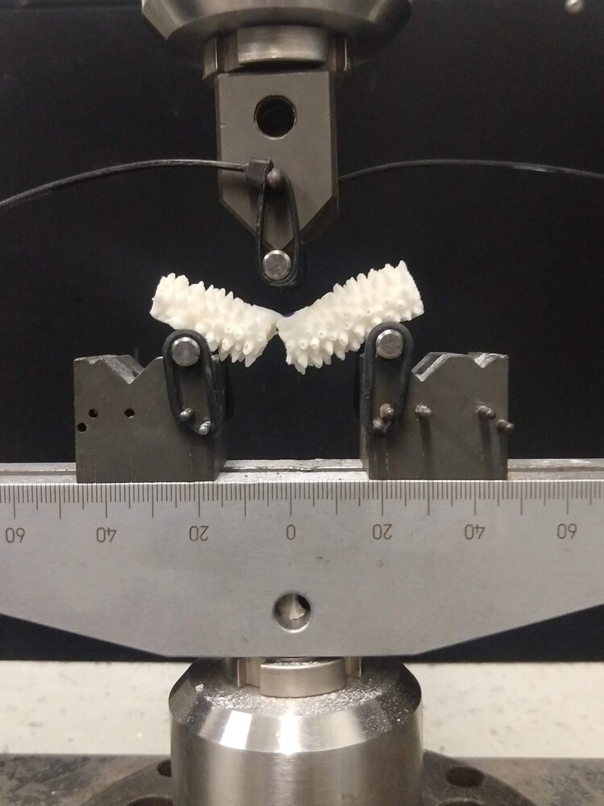

# Mechanical Strength of Nursery Raised *Acropora cervicornis*

Here, I investigated the mechanical strength of the threatened staghorn coral to understand how restoration nursery structures influence the structural integrity of the corals and the implications of this effect on mechanical strength for coral restoration projects.

This thesis was born out of a collaborative [University of Miami U-LINK grant](https://ulink.miami.edu/projects/index.html#coastal-resilience) to explore the efficacy of increasing the coastal resilience of Miami Beach through the design and implementation of living shorelines. Working with a team of ecologists, oceanographers, and engineers, I designed this project to build upon previous restoration ecology research to better understand the structural properties and mechanical strength of nursery-raised <em>Acropora cervicornis</em>. This project was additionally supported by the Dr. Linda Farmer Undegraduate Research Grant ($2,500).

  

## Abstract
Branching corals are dominated by drag forces and therefore understanding the bending stress of staghorn corals is important to understand fragmentation (Vosburgh 1977). The addition of branching corals to a reef structure has been shown to mitigate up to an additional 10% of wave height and 14% of wave energy through increased friction (Ghiasian et al. 2020), thus ensuring the persistance of outplanted corals for wave attenuation projects is paramount. Corals grown on blocks were found to have increased ultimate bending strength compared to corals grown on trees, and therefore are likely to have decreased branch fragmentation. However, whole-colony fragmentation or colony dislodgment is more likely to be influenced by the strength of the hard-bottom substrate and the interfacial transition zone (ITZ) (Madin 2005). Further, colony dislodgement is likely to occur before branch fragmentation as seen in both ecological field studies and lab-based engineering studies (Tunniclife 1981, Madin 2005). Therefore, the increased mechanical strength of block-reared corals may not be realized. We recommend that restoration practitioners focus on mitigating boring species and implement outplanting methodologies that increase the bond strength of the coral and hardbottom substrate to decrease whole-colony fragmentation in high energy environments before focusing on implementing block structures in nurseries.

## References
- Madin JS (2005) Mechanical limitations of reef corals during hydrodynamic disturbances. Coral Reefs 24:630–635
- Tunnicliffe V (1981) Breakage and propagation of the stony coral Acropora cervicornis. Proc Natl Acad Sci 78:2427–2431
- Vosburgh F (1977) The response to drag of the reef coral Acropora reticulata. Proc Third Int Coral Reef Symp, Miami, FL 1:477-482 
- Ghiasian M, Carrick J, Rhode-Barbarigos L, Haus B, Baker AC, Lirman D (2020) Dissipation of wave energy by a hybrid artificial reef in a wave simulator: implications for coastal resilience and shoreline protection. 
